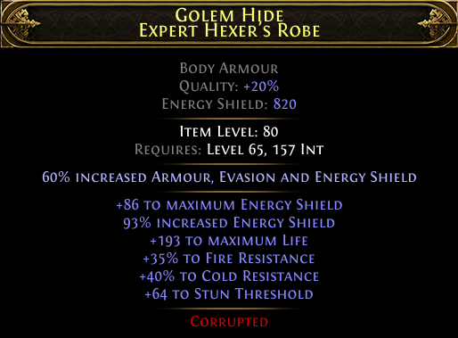

# poe2-item-canvas-renderer

* parse CTRL+C item with `Path-of-Tools/poe-item-parser`
* render to a canvas with `Automattic/node-canvas`
* node-canvas is compatible with the whatwg canvas spec, so this should work for web canvas as well with minimal changes
* test with `node test.js`

## Usage example

```js
import { PoE2ItemParser } from 'poe-item-parser'
import { renderItem } from 'poe2-item-canvas-renderer'

const item = `
Item Class: Body Armours
Rarity: Rare
Golem Hide
Expert Hexer's Robe
--------
Quality: +20% (augmented)
Energy Shield: 820 (augmented)
--------
Requirements:
Level: 65
Int: 157
--------
Sockets: S S S
--------
Item Level: 80
--------
60% increased Armour, Evasion and Energy Shield (rune)
--------
+86 to maximum Energy Shield
93% increased Energy Shield
+193 to maximum Life
+35% to Fire Resistance
+40% to Cold Resistance
+64 to Stun Threshold
--------
Corrupted
`

const parsedItem = (new PoE2ItemParser(item)).getItem()

const canvas = await renderItem(parsedItem)
const out = fs.createWriteStream('./example.png')
const stream = canvas.createPNGStream()
stream.pipe(out)

out.on('finish', () => console.log('example.png created'))
```

**Output:**



## Notes

`node test.js` parses all items in the `items/` folder and writes out an image and a json file (parser output) for each.

## Notes

Local parser in `package.json`:

```
"poe-item-parser": "file:../poe-item-parser"
```

## Copyright

Content of `assets/` folder is © Grinding Gear Games